<!-- BANNER - terminal profile.sh --live. Generated by scripts/banner.py (reads profile/stats.json). -->
<picture>
  <source media="(prefers-color-scheme: dark)"  srcset="profile/banner-dark.svg">
  <source media="(prefers-color-scheme: light)" srcset="profile/banner-light.svg">
  
</picture>

 

<!-- NAME / TAGLINE - animated typing -->

 

<!-- SOCIALS — LinkedIn and Telegram keep brand colors (glyphs vanish on custom fills). Email themed. -->
&nbsp;&nbsp;
&nbsp;&nbsp;

 

---

## This is me :)

Hi, I'm **Hamed Kazemi**, a mobile and full-stack engineer.
I build apps people actually open every day, from the screen they tap
to the API behind it, and I like owning the whole path in between.

- 📱 **Mobile first**: Flutter for cross-platform, Swift and Kotlin when the platform deserves native.
- 🎯 **Building social platforms**: currently shipping **FrFr**, a social app with a native iOS client and a TypeScript / Node.js backend on MongoDB.
- 🌐 **Web and backend**: React + Vite on the front, Node.js / TypeScript APIs behind it.
- 🧩 **Design to code**: comfortable in Figma, obsessed with UI that feels right on a real device.
- 🛠️ **Always exploring**: new tools, frameworks and whatever makes shipping faster.
- 💬 Talk to me about **mobile architecture** or **building a social app from zero** and you'll have my full attention.
 

## my perfect stack

---

## signals

<table>
<tr>
<td width="50%" align="center" valign="middle">

<!-- Self-rated radar - edit profile/skills.json, the workflow redraws it -->
<picture>
  <source media="(prefers-color-scheme: dark)"  srcset="profile/radar-dark.svg">
  <source media="(prefers-color-scheme: light)" srcset="profile/radar-light.svg">
  
</picture>

</td>
<td width="50%" align="center" valign="middle">

<!-- Hand-authored language radar - edit profile/langmix.json -->
<picture>
  <source media="(prefers-color-scheme: dark)"  srcset="profile/radar-langs-dark.svg">
  <source media="(prefers-color-scheme: light)" srcset="profile/radar-langs-light.svg">
  
</picture>

</td>
</tr>
</table>

---

## Numbers matter? ohhh yes.

<!-- Generated by scripts/cards.py into this repo. Deliberately NOT
     github-readme-stats / streak-stats: those are shared public instances
     that go down and take the whole section with them. -->
<picture>
  <source media="(prefers-color-scheme: dark)"  srcset="profile/card-stats-dark.svg">
  <source media="(prefers-color-scheme: light)" srcset="profile/card-stats-light.svg">
  
</picture>

 

<picture>
  <source media="(prefers-color-scheme: dark)"  srcset="profile/languages-dark.svg">
  <source media="(prefers-color-scheme: light)" srcset="profile/languages-light.svg">
  
</picture>

---

` Built with love · @hamed75kazemii `

